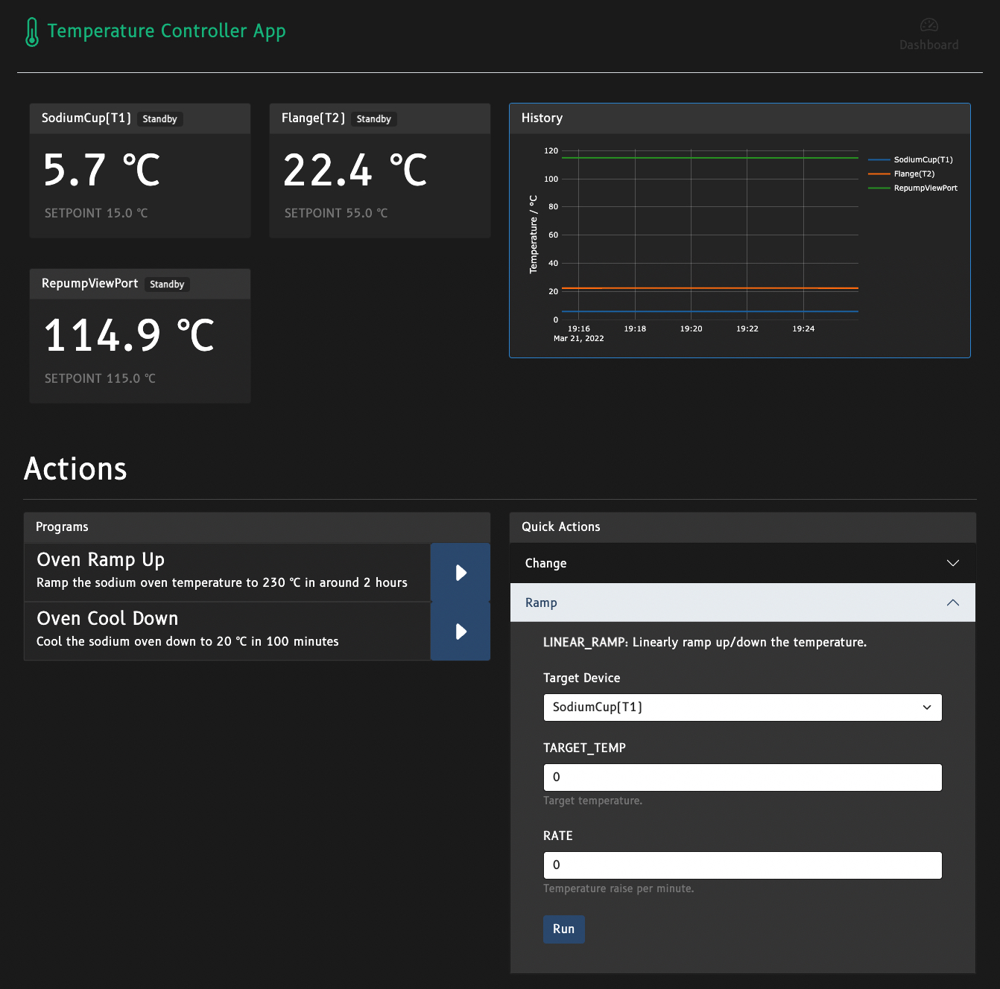

# Temperature Control App

_Access and monitor your favorite temperature controllers from your browser._



A web app that gathers data from temperature controllers and posts them to a
web dashboard. Suitable for people who want to simplify day-to-day temperature
routine.

Basic function like _changing setpoint_ and _ramping_ can be triggered inside
the web app, while one can also define more complicated routines like a 
combination of ramping up and down involving multiple controllers.


## Installation

This app requires [Python 3.7+](https://www.python.org/) and [npm](https://www.npmjs.com/) (for
managing web dependencies). You should install them first and make sure they can be invoked from
command line.

It is always a good habit to create a virtual environment first to make
sure your local environment won't be contaminated:
```
python -m venv venv
```

Now you have two choices: install the _wheel_ or install from source.

### Install from pre-built wheel

Download pre-built wheel (.whl file) from [Release](https://github.com/JQIamo/temperature-control-app/releases/)
and run
```
venv/bin/pip install [path_to_downloaded_wheel]
```

That's it.

### Install from source

First, clone this repo to a convenient location.

After creating the virtual environment, build web assets and install them by
```
venv/bin/pip install .
```

This line will **copy the source code to the `site-packages` location** and install the package to
your virtual environment. If you don't want `pip` to copy the source but would to like to install
_in place_, run
```
venv/bin/pip install --editable .
```

This way, you may edit the source code under this folder and directly and run and test them easily.

## Run

To run the app, simply by
```
venv/bin/temperature_app --config [path to config]
```
The format of the configuration file will be introduced in the next section.

## Configuration

The configuration file is in [YAML](https://yaml.org/) format. Here in this
repo, I present two sample configuration file [config_dummy.yml](config_dummy.yml)
(which controls two dummy test instance) and [config_omega.yml](config_omega.yml).
(which controls three Omega iSeries process controllers through Ethernet).

The configuration file is more or less self-explanatory. There's a few fields
defines some time constants.

### Devices

The _devices_ section defines devices the app accesses. For example,
```yaml
devices:
  - name: SodiumCup(T1)
    dev_type: Omega iSeries Ethernet
    addr: 192.168.12.200
    port: 2000 
```

Here I defined a device called `SodiumCup(T1)` with device type to be 
`Omega iSeries Ethernet`. `addr` and `port` are two device-dependent
parameters.

#### Supported devices

Currently, supports
- `Omega iSeries Ethernet`: Omega iSeries controller, with Ethernet connection
- `Omega iSeries Serial`: Omega iSeries controller, with Serial connection

More devices can be easily added. See the following sections.

### Programs

Each program is divided into several steps, and in each step, one can specify
a series of actions performed across different devices.

For actions supported, see the table below:

| Operation   | Description                                                                    | Parameters  |                                                           |
|-------------|--------------------------------------------------------------------------------|-------------|-----------------------------------------------------------|
| CHANGE      | Immediately change the setpoint to a value and wait until temperature settles. | SETPOINT    | Target setpoint, in °C.                                   |
| LINEAR_RAMP | Linearly ramp up/down the temperature.                                         | TARGET_TEMP | Target temperature, in °C.                                |
|             |                                                                                | RATE        | Temperature raise per minute.                             |
| SOAK        | Hold the current temperature.                                                  | TIME        | Duration of soak in minutes.                              |
| STANDBY     | Disengage the controller. Put it into Standby mode.                            |             |                                                           |
| LOOP        | Jump back to a specific step and loop for a defined number of times.           | GOTO        | The number of the step to jump back to (starting from 0). |
|             |                                                                                | TIMES       | The number of times to loop.                              |

The following code defines a _Cool Down_ program that ramp down the temperatures
of two different controllers (in step 0) and put both of them in standby
mode (step 1).

Expressing nested list can be somewhat confusing in YAML. Please note the difference between
`-` and `- -`.

```yaml
  - name: Oven Cool Down
    description: Cool the sodium oven down to 20 °C in 100 minutes
    steps:
      - - action: LINEAR_RAMP
          device: SodiumCup(T1)
          params:
            TARGET_TEMP: 20
            RATE: 2
        - action: LINEAR_RAMP
          device: Flange(T2)
          params:
            TARGET_TEMP: 20
            RATE: 2.4
      - - action: STANDBY
          device: SodiumCup(T1)
        - action: STANDBY
          device: Flange(T2)
```

## Development

This app relies on Python for the server and [React.js](https://reactjs.org/) for the web 
dashboard. I used quite a bit of Async IO in the server.

### Add new drivers

The good news is if you just want to add new devices to this app, you don't need to know web
development and Async IO. All you need is:

1. Copy [driver/dummy_driver.py](temperature_web_control/driver/dummy_driver.py)
   (which is an example) and rename it to `[blah]_driver.py` and put
   it under the `driver/` folder. It has to end with `_driver.py` to be auto-imported by the 
   core.
2. Rewrite all methods inside `DummyDevice` and functions below (see comments). This part is 
   the code that really interacts with the controller devices.

### Add plugins

If you have an external logger like InfluxDB, you may want to also write a script to grab the 
temperature data and upload them.
In this case, you can write a plugin that subscribes to the `status_available` event of the
app core.

You may check out [plugin/influx_push_plugin.py](temperature_web_control/plugin/influx_push_plugin.py)
and change the push logic to suit your need.

Also, save you plugin into the `plugin/` folder and named it with `[blah]_plugin.py` for the
auto-import mechanism to work.

